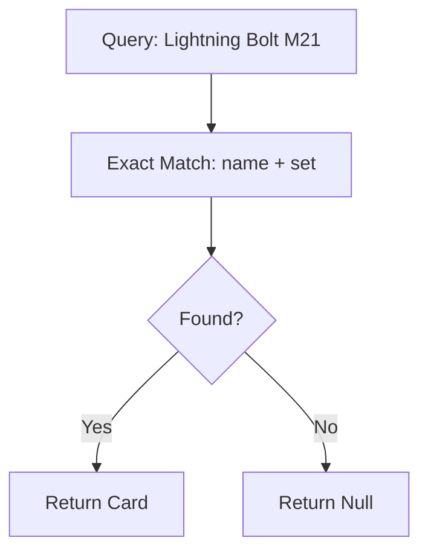
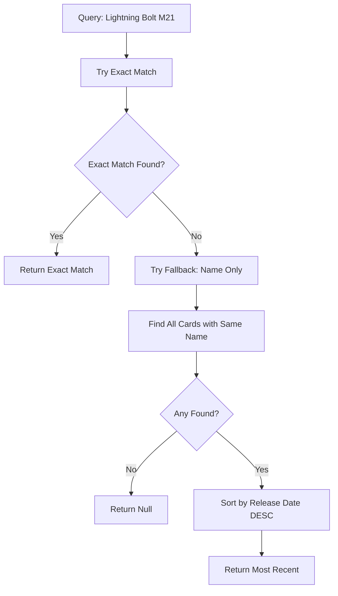

# MTG Card Fallback Implementation Plan

## Objective
Implement a simple fallback mechanism: when a card and set don't exactly match, fallback to find the same card name from the most recent set available in the database.

## Simplified Architecture

### Current Flow


### Enhanced Flow


## Implementation Changes

### 1. Enhanced Card Database (`src/services/card-database.ts`)

#### New Index Structure
```typescript
export class CardDatabase {
  private cards: ScryfallCard[] = [];
  private nameSetIndex: Map<string, ScryfallCard[]> = new Map(); // existing
  private nameOnlyIndex: Map<string, ScryfallCard[]> = new Map(); // NEW
}
```

#### Modified `buildIndex()` Method
```typescript
private buildIndex(): void {
  console.log('Building search index...');
  this.nameSetIndex.clear();
  this.nameOnlyIndex.clear(); // NEW

  for (const card of this.cards) {
    // Existing exact match index
    const exactKey = this.createIndexKey(card.name, card.set);
    if (!this.nameSetIndex.has(exactKey)) {
      this.nameSetIndex.set(exactKey, []);
    }
    this.nameSetIndex.get(exactKey)!.push(card);

    // NEW: Name-only index for fallback
    const nameKey = normalizeString(card.name);
    if (!this.nameOnlyIndex.has(nameKey)) {
      this.nameOnlyIndex.set(nameKey, []);
    }
    this.nameOnlyIndex.get(nameKey)!.push(card);
  }

  console.log(`Index built with ${this.nameSetIndex.size} exact matches and ${this.nameOnlyIndex.size} unique card names`);
}
```

#### Enhanced `findCard()` Method
```typescript
private findCard(query: CardQuery): ScryfallCard | null {
  // 1. Try exact match first (existing behavior)
  const exactKey = this.createIndexKey(query.name, query.set);
  const exactCandidates = this.nameSetIndex.get(exactKey);
  
  if (exactCandidates && exactCandidates.length > 0) {
    return exactCandidates[0]; // Return first exact match
  }

  // 2. NEW: Fallback to name-only match
  const nameKey = normalizeString(query.name);
  const fallbackCandidates = this.nameOnlyIndex.get(nameKey);
  
  if (!fallbackCandidates || fallbackCandidates.length === 0) {
    return null; // No matches found
  }

  // 3. NEW: Return most recent printing
  return this.getMostRecentCard(fallbackCandidates);
}
```

#### New Helper Method
```typescript
private getMostRecentCard(cards: ScryfallCard[]): ScryfallCard {
  return cards.sort((a, b) => {
    // Sort by released_at date (most recent first)
    const dateA = a.released_at ? new Date(a.released_at) : new Date(0);
    const dateB = b.released_at ? new Date(b.released_at) : new Date(0);
    return dateB.getTime() - dateA.getTime();
  })[0];
}
```

### 2. Enhanced Types (`src/types/card-query.ts`)

```typescript
export interface CardMatch {
  query: CardQuery;
  card: ScryfallCard;
  matchType: 'exact' | 'fallback'; // NEW: Track match type
}

export interface MatchResult {
  matches: CardMatch[];
  unmatched: CardQuery[];
}
```

### 3. Enhanced Reporting

#### Updated `findMatches()` Method
```typescript
public findMatches(queries: CardQuery[]): MatchResult {
  const matches: CardMatch[] = [];
  const unmatched: CardQuery[] = [];

  console.log(`Searching for ${queries.length} cards...`);

  for (const query of queries) {
    const exactKey = this.createIndexKey(query.name, query.set);
    const exactMatch = this.nameSetIndex.get(exactKey)?.[0];
    
    if (exactMatch) {
      // Exact match found
      matches.push({
        query,
        card: exactMatch,
        matchType: 'exact'
      });
    } else {
      // Try fallback
      const fallbackCard = this.findCard(query); // This now includes fallback logic
      if (fallbackCard) {
        matches.push({
          query,
          card: fallbackCard,
          matchType: 'fallback'
        });
        console.log(`  Fallback: ${query.name} [${query.set}] → found in [${fallbackCard.set.toUpperCase()}] (${fallbackCard.released_at})`);
      } else {
        unmatched.push(query);
      }
    }
  }

  const exactCount = matches.filter(m => m.matchType === 'exact').length;
  const fallbackCount = matches.filter(m => m.matchType === 'fallback').length;
  
  console.log(`Found ${exactCount} exact matches, ${fallbackCount} fallback matches, ${unmatched.length} unmatched`);
  
  return { matches, unmatched };
}
```

## Test Cases

### Sample Input (`data/test-fallback.txt`)
```text
# These should work with exact matching
Lightning Bolt [LEA]
Green Dragon [AFR]

# These should trigger fallback to most recent set
Lightning Bolt [M21]        # Should fallback to LEA (most recent in our sample)
Counterspell [KLD]          # Should fallback to 2ED (most recent in our sample)
Green Dragon [ZNR]          # Should fallback to AFR (most recent in our sample)

# This should remain unmatched
Nonexistent Card [FAKE]
```

### Expected Behavior
- `Lightning Bolt [LEA]` → **Exact match** → LEA printing
- `Lightning Bolt [M21]` → **Fallback** → LEA printing (most recent available)
- `Counterspell [KLD]` → **Fallback** → 2ED printing (most recent available)
- `Green Dragon [ZNR]` → **Fallback** → AFR printing (most recent available)

## Benefits of Simplified Approach

✅ **Simple Logic**: Just sort by release date, pick the most recent  
✅ **Clear Behavior**: Users get the latest available printing  
✅ **Minimal Changes**: Only affects card-database.ts and types  
✅ **Backward Compatible**: All existing exact matches work unchanged  
✅ **Fast Performance**: Simple date sort on small candidate sets  

## Implementation Summary

1. **Add name-only index** for efficient fallback lookups
2. **Enhance findCard()** to try exact match first, then fallback
3. **Add getMostRecentCard()** helper to sort by release date
4. **Update match reporting** to distinguish exact vs fallback matches
5. **Add test cases** to verify fallback behavior

This approach provides the requested fallback functionality with minimal complexity while maintaining the tool's existing reliability and performance.