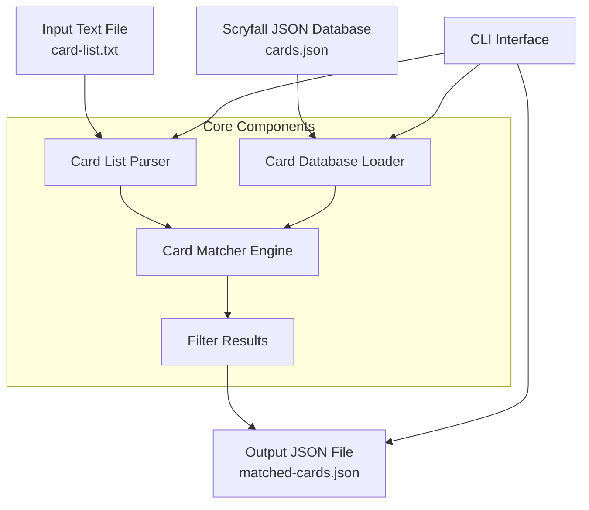

# MTG Card Filter Tool

A TypeScript command-line tool that reads a list of Magic: The Gathering card names with set codes from a text file, matches them against a local Scryfall JSON database, and outputs the matching card data to a new JSON file.

## Features

- **Input Processing**: Parse text files with format `Card Name [SET]` or `Count Card Name [SET]`
- **Exact Matching**: Case-insensitive exact matching for both card names and set codes
- **Intelligent Fallback**: When exact matches fail, automatically finds cards by name from the most recent available set
- **JSON Output**: Write matched cards to a new JSON file
- **Enhanced Reporting**: Clear distinction between exact and fallback matches
- **Error Handling**: Comprehensive error reporting and validation
- **CLI Interface**: Command-line interface with helpful options

## Architecture

### System Overview


### Class Structure
```mermaid
classDiagram
    class CardFilterTool {
        +main(args: string[])
        -parseArguments(args: string[])
        -displayHelp()
    }
    
    class CardListParser {
        +parseFile(filePath: string): CardQuery[]
        -parseLine(line: string): CardQuery
        -extractCardNameAndSet(line: string): {name: string, set: string}
    }
    
    class CardDatabase {
        +loadFromFile(filePath: string): ScryfallCard[]
        +findMatches(queries: CardQuery[]): ScryfallCard[]
        -matchCard(query: CardQuery, card: ScryfallCard): boolean
        -normalizeString(str: string): string
    }
    
    class OutputWriter {
        +writeToFile(cards: ScryfallCard[], outputPath: string)
        +generateReport(cards: ScryfallCard[], queries: CardQuery[])
    }
    
    class CardQuery {
        +name: string
        +set: string
        +originalLine: string
    }
    
    class ScryfallCard {
        +name: string
        +set: string
        +id: string
        +oracle_id: string
        +[other_properties]: any
    }
    
    CardFilterTool --> CardListParser
    CardFilterTool --> CardDatabase
    CardFilterTool --> OutputWriter
    CardListParser --> CardQuery
    CardDatabase --> ScryfallCard
    CardDatabase --> CardQuery
```

## Project Structure

```
mtg-card-filter/
├── src/
│   ├── index.ts              # Main entry point and CLI interface
│   ├── types/
│   │   ├── scryfall.ts       # Scryfall card type definitions
│   │   └── card-query.ts     # Internal types for queries
│   ├── services/
│   │   ├── card-parser.ts    # Parse input text file
│   │   ├── card-database.ts  # Load and search JSON database
│   │   └── output-writer.ts  # Write results to file
│   └── utils/
│       └── string-utils.ts   # String normalization utilities
├── data/
│   ├── sample-cards.json     # Sample Scryfall data
│   └── sample-input.txt      # Sample input file
├── dist/                     # Compiled JavaScript output
├── package.json
├── tsconfig.json
├── .gitignore
└── README.md
```

## Installation

```bash
# Clone the repository
git clone <repository-url>
cd mtg-card-filter

# Install dependencies
npm install

# Build the project
npm run build
```

## Usage

### Command Line Interface

```bash
# Basic usage
npm run filter -- --input cards-to-find.txt --database all-cards.json --output matched-cards.json

# With additional options
npm run filter -- -i input.txt -d database.json -o output.json --pretty --report

# Show help
npm run filter -- --help
```

### Input Format

Create a text file with card names and set codes. The tool supports both formats with and without card counts:

```
# Format without counts
Lightning Bolt [LEA]
Black Lotus [LEA]
Ancestral Recall [LEA]

# Format with counts (counts are ignored during matching)
1 Lightning Bolt [LEA]
4 Green Dragon [AFR]
2 Counterspell [2ED]

# This is a comment - lines starting with # are ignored
# Empty lines are also ignored
```

**Supported formats:**
- `Card Name [SET]` - Standard format
- `Count Card Name [SET]` - With quantity (count is ignored)
- Lines starting with `#` are treated as comments
- Empty lines are ignored

### Scryfall JSON Database

The tool expects a JSON file containing an array of Scryfall card objects. Example structure:

```json
[
  {
    "object": "card",
    "id": "45804134-cc04-4587-9674-2c884964083d",
    "oracle_id": "c2a4c6c7-e5b4-4cc8-91d8-5de8cc95ed00",
    "name": "Green Dragon",
    "set": "afr",
    "set_name": "Adventures in the Forgotten Realms",
    "mana_cost": "{4}{G}{G}",
    "type_line": "Creature — Dragon",
    "oracle_text": "Flying\nPoison Breath — When this creature enters, until end of turn, whenever a creature an opponent controls is dealt damage, destroy it.",
    "power": "4",
    "toughness": "4",
    "colors": ["G"],
    "rarity": "uncommon",
    "prices": {
      "usd": "0.14",
      "usd_foil": "0.21"
    }
  }
]
```

### Output

The tool generates a JSON file containing only the matched cards:

```json
[
  {
    "object": "card",
    "id": "45804134-cc04-4587-9674-2c884964083d",
    "name": "Green Dragon",
    "set": "afr",
    // ... full Scryfall card object
  }
]
```

## CLI Options

| Option | Short | Description | Default |
|--------|-------|-------------|---------|
| `--input` | `-i` | Input text file path | Required |
| `--database` | `-d` | Scryfall JSON database file | Required |
| `--output` | `-o` | Output JSON file path | `matched-cards.json` |
| `--pretty` | `-p` | Pretty-print JSON output | `false` |
| `--report` | `-r` | Generate summary report | `false` |
| `--help` | `-h` | Show help message | - |

## Matching Logic

The tool uses a two-tier matching system:

### Primary Matching (Exact)
- **Card Names**: Case-insensitive exact match after normalization
- **Set Codes**: Case-insensitive exact match
- **Normalization**: Trims whitespace and handles special characters consistently

### Fallback Matching
When an exact name+set combination is not found, the tool automatically falls back to:
- **Name-only matching**: Finds cards with the same name from any available set
- **Most recent printing**: Selects the card with the most recent release date
- **Clear reporting**: Distinguishes between exact and fallback matches in output

**Example:**
- Query: `Lightning Bolt [M21]` (not in database)
- Fallback: Finds `Lightning Bolt [LEA]` (most recent available printing)
- Console output: `Fallback: Lightning Bolt [M21] → found in [LEA] (1993-08-05)`

## Error Handling

The tool provides comprehensive error handling for:

- File not found errors
- Invalid JSON format in database
- Malformed input lines
- Permission errors when writing output
- Memory constraints for large files

## Development

### Scripts

```bash
npm run build     # Compile TypeScript to JavaScript
npm run dev       # Run in development mode with watch
npm run test      # Run unit tests
npm run lint      # Run ESLint
npm run filter    # Run the compiled tool
```

### Testing

```bash
# Run all tests
npm test

# Run tests with coverage
npm run test:coverage

# Run tests in watch mode
npm run test:watch
```

## Sample Data

The `data/` directory contains sample files to help you get started:

- `sample-cards.json`: Example Scryfall card data
- `sample-input.txt`: Example input file format

## Contributing

1. Fork the repository
2. Create a feature branch
3. Make your changes
4. Add tests for new functionality
5. Run the test suite
6. Submit a pull request

## License

MIT License - see LICENSE file for details.